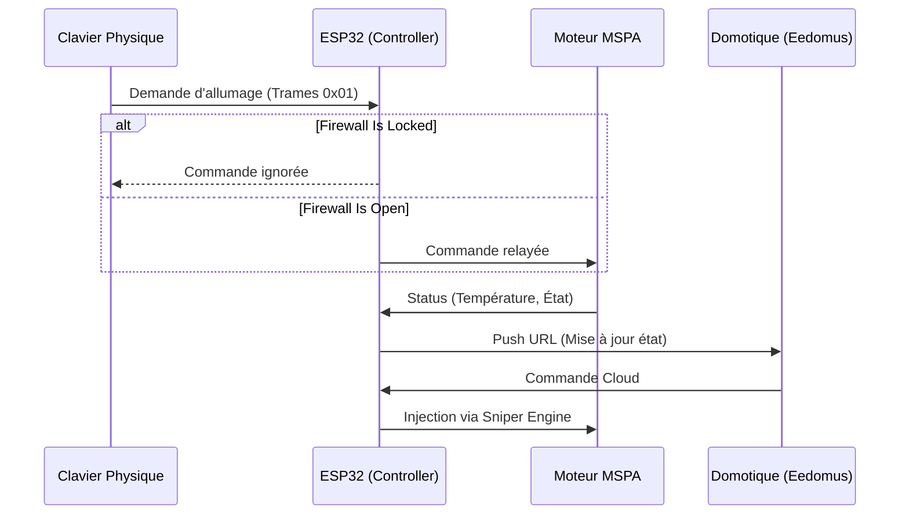

# 💎 MSPA Man-in-the-Middle Ecosystem (ESP32)

[](esphome/mspa-controller.yaml)
[](esphome/mspa-simulator.yaml)
[](esphome/mspa-sniffer.yaml)

Bienvenue dans l'écosystème **MSPA-Controller**, la solution ultime pour transformer ton spa MSPA (Série D) en un objet connecté de pointe, sans sacrifier la sécurité ni la fidélité matérielle.

---

## 🏗️ L'Architecture "One-Stop-Shop"

Ce dépôt regroupe les trois piliers essentiels pour domotiser, tester et auditer ton spa :

### 1. 📟 [Le Contrôleur (MITM)](esphome/mspa-controller.yaml)
Le cerveau opérationnel. Placé entre le clavier et le moteur, il agit comme un pont intelligent (**Man-in-the-Middle**).
- **Intégration Eedomus** : Synchronisation bidirectionnelle native (API HTTP).
- **UART Firewall** : Verrouillage du clavier physique à distance.
- **Sniper Engine** : Injection de commandes ultra-précise (latence < 100ms).

### 2. 🧪 [Le Simulateur (Banc d'essai)](esphome/mspa-simulator.yaml)
Une copie atomique du spa réel. Indispensable pour développer et tester tes scripts sans sortir au froid.
- **Staggered Heartbeat** : Reproduction millimétrée du flux UART officiel.
- **Atomic Realism** : Signature binaire 100% conforme aux traces matérielles.

### 3. 🔍 [Le Sniffer (Audit)](esphome/mspa-sniffer.yaml)
L'outil de diagnostic passif. Décode et affiche en temps réel les trames `0xA5` circulant sur le bus pour le débogage profond.

---

## 🛡️ Fonctionnalités Premium



### ✨ Pourquoi c'est différent ?
- **Silk Filter** : L'interface utilisateur ne "devine" jamais l'état du spa. Elle attend la confirmation réelle venant du bit de retour de la pompe/chauffe pour s'allumer.
- **Safe-Cap 40°C** : Sécurité logicielle interdisant toute consigne supérieure à la limite constructeur.
- **Optimization Safe-Sync** : Réduction de 90% du trafic réseau inutile ; le contrôleur ne parle que lors d'un vrai changement d'état.

---

## 🛠️ Installation & Démarrage

1.  **Environnement** : Installe [ESPHome](https://esphome.io/) sur ton PC.
2.  **Configuration** :
    - Copie `esphome/secrets.yaml.example` vers `esphome/secrets.yaml`.
    - Remplis tes accès WiFi et tes IDs de périphériques Eedomus.
3.  **Flashage** :
    ```powershell
    # Pour le contrôleur principal
    py -m esphome run esphome/mspa-controller.yaml
    ```

---

## 📸 Conseil Photo & Documentation

> [!IMPORTANT]
> Pour un setup complet, nous recommandons d'ajouter des photos de votre montage dans un dossier `/images` :
> - **Hardware** : Votre câblage Man-in-the-Middle.
> - **Dashboard** : Votre interface Eedomus personnalisée.
> - **WebUI** : L'interface native ESPHome en mode Glassmorphism.

---

*Projet maintenu par Etienne. Stabilité validée le 04/04/2026.*
