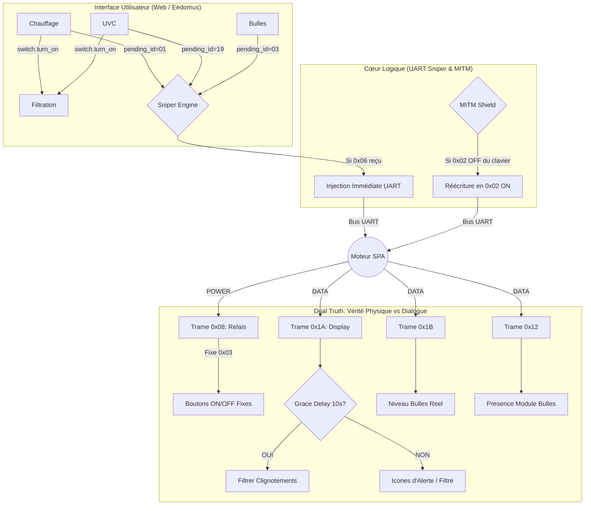

# Spécifications logiques du contrôleur MSPA (ESP32)

## 1. Hiérarchie des commandes (synchronisation)

- **Entité numérique** : eedomus + interface Web ESP32 = un seul organe de commande.
- **Priorité** : "Dernier qui parle a raison".
- **Bouton physique** : L'ESP32 détecte l'appui sur le clavier, met à jour son état interne et informe les API externes (Eedomus).

- **Source ID 0x08 (VÉRITÉ MACHINE)** : État des relais de puissance.
    - `0x00` : **Moteur OFF**. Aucun flux d'eau.
    - `0x03` : **Moteur ON**. Signal universel pour Filtration, Chauffage et UVC.
    - *Observation* : Cet état est ultra-stable et précède souvent la mise à jour visuelle (1A).
- **Source ID 0x1A (VÉRITÉ DIALOGUE)** : Ordres visuels envoyés au clavier.
    - `Bit 0` : Filtration / `Bit 1` : Chauffage / `Bit 2` : UVC / `Bit 3` : Prêt.
    - **Signification du Clignotement** : Indique une **phase de test ou de montée en régime** (ex: le SPA vérifie le flux d'eau avant de stabiliser la chauffe).
    - **Signification du Fixe** : Indique que la **procédure est validée** et que la fonction est en régime nominal.
    - *Usage* : Détection d'intention. On peut DÉDUIRE l'état stable de l'UI dès le premier clignotement.
- **Source ID 0x1B (Consigne/Bulles)** : Source absolue pour le niveau des bulles (D1) et température cible (D2).
- **Source ID 0x12 (Module Bulles)** : Heartbeat de présence du moteur à air.

## 3. Stratégie d'Injection : Les 2 Modes Validés (v3.9.3)

> [!IMPORTANT]
> Cette architecture est le résultat de tests intensifs. Ne pas modifier l'ID de déclenchement sans capture UART préalable.

### Mode Sniper Synchrone sur `0x06` (Bulles, Chauffage, UVC)
- **Déclencheur** : Réception de la trame `0x06` (Température) envoyée par le SPA.
- **Principe** : L'ESP32 injecte la commande (`0x01`, `0x19` ou `0x03`) immédiatement après. C'est la fenêtre où le moteur est le plus à l'écoute.
- **Avantage** : Réactivité instantanée (< 500ms) et aucune collision sur le bus.

### Mode MITM Interception (Filtration `0x02`)
- **Principe** : Le clavier envoie `0x02 OFF` en boucle. L'ESP32 intercepte physiquement cette trame et la réécrit en `0x02 ON` si nécessaire.
- **Rôle** : Sert de "Bouclier" (Shield) pour maintenir la pompe active pendant la chauffe, peu importe l'ordre du clavier physique.

## 4. Retour d'Etat : Système Grace Delay (10s)

Lors du démarrage de la pompe, l'ID `0x1A` émet des signaux instables ("fantômes").
- **Filtre de 10s** : Pendant les 10 secondes suivant un passage de la Pompe à ON, les bits de Chauffe et d'UVC sont ignorés par l'UI pour garantir une stabilité parfaite des icônes.

## 5. Logique d'Interlock UI (v3.9.3)

Pour garantir une cohérence visuelle "Professionnelle" :
- **Liaison Ascensionnelle** : Allumer la Chauffe ou l'UVC actionne automatiquement le switch "Filtration" dans l'UI.
- **Liaison Descendante** : Éteindre la Chauffe ne coupe la Filtration que si l'UVC est également éteint (et inversement).
- **Cascade de Sécurité** : L'arrêt forcé de la Filtration par l'utilisateur entraîne l'extinction visuelle immédiate de la Chauffe et de l'UVC.

## 6. Télémétrie température

## 7. Schéma Fonctionnel (Architecture v3.9.3)

## 8. Intégrité des données de Consigne (v6.3.4)

Pour garantir la stabilité de l'affichage et de l'intégration domotique (eedomus) :
- **Conversion Signée** : L'octet brut $D2$ de la trame `0x1B` est interprété comme un `int8_t` avant d'ajouter l'offset 30. Cela permet de supporter les consignes inférieures à 30°C (représentées par des valeurs négatives sur le bus UART).
- **Ceinture de Sécurité** : Un filtre de rejet est appliqué dans le décodeur C++. Toute valeur calculée en dehors de la plage **20°C - 42°C** est ignorée pour protéger l'interface contre les parasites UART (ex: lecture accidentelle d'un checksum décalé).
- **Persistance** : En cas de détection d'une trame incohérente, l'interface conserve et affiche la dernière valeur saine connue.

## 9. Gestion de l'Alerte Filtration (v6.3.4)

Pour distinguer une phase de test (clignotement au démarrage) d'une réelle alerte de maintenance :
- **Condition d'Alerte** : L'ID `0x1A` (Bit 0) doit être en état de **clignotement** alors que l'ID `0x08` (Relais Physique) est à **0x00 (OFF)**.
- **Retour d'État Hybride** : Le switch "Filtration" de l'UI utilise une condition combinée : il affiche **ON** si et seulement si l'icône est présente (`1A`) **ET** le relais physique est actif (`08`).
- **Principe** : Si le moteur demande à l'icône de clignoter mais que le relais de la pompe n'est pas activé, il s'agit d'une demande de changement de filtre ("Clean Filter"). L'UI masque alors la filtration et affiche uniquement l'alerte.
- **Réactivité** : L'alerte est déclenchée dès la validation du premier cycle de clignotement (~1 seconde).

## 10. Firewall UART : Mode Verrouillage (v6.3.5)

Pour empêcher l'utilisation non autorisée du clavier physique (sécurité enfant / blocage à distance) :
- **Principe de Sélectivité** : Le contrôleur passe d'un transfert "octet par octet" à un transfert "par trame vérifiée" (MITM Intelligent). 
- **Filtrage des Commandes** : Lorsque le mode **Verrouillage** est actif, toutes les trames de commande (`0x01`, `0x02`, `0x03`, `0x19`, `0x04`) venant du clavier sont interceptées et bloquées.
- **Exception Heartbeat (0x0D)** : La trame de présence clavier (`0x0D`) est **toujours transmise**. Cela évite que le moteur du SPA ne se mette en erreur de communication si le verrouillage est activé trop longtemps.
- **Transparence UI** : L'interface Web et les ordres domotiques restent totalement prioritaires et fonctionnels même si le clavier physique est verrouillé.
