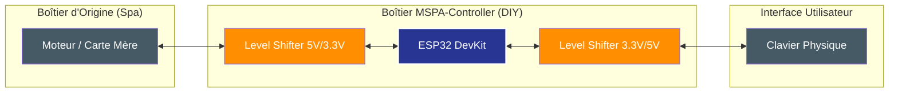

# 📐 Schéma Hardware & Synoptique

Ce document détaille l'architecture physique du projet **MSPA-Controller**. Il montre comment l'ESP32 s'intègre en "Man-in-the-Middle" (MITM) tout en protégeant ses composants via des convertisseurs de niveau logique.

---

## 1. Synoptique Global (Concept MITM)

L'ESP32 est placé sur le bus de communication d'origine. Il intercepte les trames du clavier, les analyse (Firewall) et les relaie au moteur (et inversement).

---

## 2. Schéma de Câblage (Détails des Pins)

L'ESP32 utilise deux ports UART matériels. Pour chaque port, un canal de **Level Shifter** est nécessaire pour convertir le signal 3.3V de l'ESP en 5V (standard MSPA).

### A. Alimentation
| Signal | Provenance (Connecteur Moteur) | Destination | Note |
| :--- | :--- | :--- | :--- |
| **VCC (5V)** | Fil ROUGE (Bus Spa) | Pin **5V / VIN** de l'ESP32 | L'ESP32 régule lui-même le 5V en 3.3V. |
| **GND (0V)** | Fil NOIR (Bus Spa) | Pin **GND** de l'ESP32 | Masse commune indispensable. |

### B. Données (UART)

| Signal Spa | Pin ESP32 | Direction | Rôle |
| :--- | :--- | :--- | :--- |
| **TX_SPA** (Vert/Jaune) | **GPIO16 (RX2)** | SPA -> ESP | Réception status température/relais |
| **RX_SPA** (Vert/Jaune) | **GPIO17 (TX2)** | ESP -> SPA | Transmission commandes au moteur |
| **RX_KBD** (Vert/Jaune) | **GPIO14 (RX1)** | CLAV -> ESP | Réception touches clavier |
| **TX_KBD** (Vert/Jaune) | **GPIO13 (TX1)** | ESP -> CLAV | Transmission feedback écran |

---

## 3. Montage du Level Shifter (Recommandé)

Le convertisseur de niveau bidirectionnel possède deux côtés :
*   **LV (Low Voltage)** : Branché au **3.3V** de l'ESP32.
*   **HV (High Voltage)** : Branché au **5V** du Spa.

> [!IMPORTANT]
> Ne jamais brancher directement les fils DATA (Vert/Jaune) du Spa sur les pins de l'ESP32 sans convertisseur. Bien que certains ESP32 "survivent" au 5V, cela finira par détruire les ports GPIO à long terme.

---

## 4. Légende des Couleurs (Standard MSPA)

Si vous utilisez les [Connecteurs JST SM recommandés](hardware_bom.md), voici la correspondance habituelle :
- **Rouge** : VCC 5V
- **Noir** : GND 0V
- **Vert / Jaune** : DATA (UART TX/RX)

---

*Schéma validé pour ESP32 DevKit V1 et Firmware v6.3.6.*
