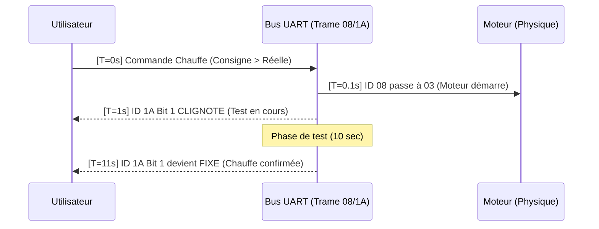

# Reverse Engineering Global – MSPA

Ce document est la "Bible" du fonctionnement du SPA. Il dépasse l'analyse technique des trames UART pour décrire l'intelligence et le comportement global de la machine.

## 1. Schéma Global des Flux

Voici comment une instruction (ex: "Chauffer") transite dans le système :

### Cycle de Vie d'une Commande
1. **INTENTION (Couche Logique)** : L'utilisateur appuie sur "Heat".
   - *UART* : `CLAV -> SPA` (`A5 01 01 A7`)
2. **ACTION (Couche Physique)** : La carte mère du SPA ferme les relais de puissance immédiatement.
   - *UART* : `SPA -> CLAV` (`A5 08 03 B0`)
   - *Effet* : La pompe s'ébroue, le relais de chauffe s'arme.
3. **PROCÉDURE (Couche Feedback)** : Le SPA teste ses capteurs (Température/Flux).
   - *Règle de Décision* : Le SPA compare la température réelle (**`06`**) à la consigne (**`1B:D2`**).
   - *UART* : `SPA -> CLAV` (`A5 1A 02 ..` alterné avec `08 ..`)
   - *Effet* : L'icône clignote sur l'écran (Vérification de la faisabilité).
4. **STABILITÉ (Couche Nominale)** : Le SPA confirme que tout est conforme.
   - *UART* : `SPA -> CLAV` (`A5 1A 02 ..` fixe)
   - *Effet* : L'icône devient fixe. La chauffe est active.

## 2. Découplage des Systèmes

Le SPA n'est pas un bloc monolithique, mais deux systèmes qui cohabitent :

| Système | Organes | Canaux de Dialogue | Canal Physique |
| :--- | :--- | :--- | :--- |
| **Circuit d'Eau** | Pompe, Chauffe, UVC | `1A` (Status), `06` (Temp), **`1B:D2`** (Consigne) | **`08`** (Relais) |
| **Circuit d'Air** | Blower (Bulles) | **`1B:D1`** (Niveau), **`12`** (Presence) | Aucun |

### Conséquences majeures :
- On peut avoir les bulles à fond sans que la pompe de circulation ne tourne.
- L'ID `0x08` ne "sait" rien des bulles. C'est le mouchard exclusif du moteur d'eau.

## 3. Logique de "Post-OP" (Sécurités)

Le SPA applique des temporisations matérielles invisibles sur le clavier mais visibles sur le bus :
- **Post-circulation** : Après l'arrêt de la chauffe ou de l'UVC, le SPA maintient l'ID `0x08` à `03` pendant ~10s alors que l'ID `1A` est déjà revenu à l'état "Prêt" (`08`).
- **Anticipation** : L'ID `0x08` (Physique) réagit souvent quelques millisecondes AVANT la trame d'affichage `1A`.

## 4. Modélisation de l'Intelligence (Machine à États)

Ce schéma décrit le comportement interne du SPA. C'est l'automate qui décide des clignotements.

```mermaid
stateDiagram-v2
    [*] --> IDLE : Mise sous tension
    
    state IDLE {
        direction lr
        note: Relais 08=00 / Voyant Prêt (1A:08)
    }

    IDLE --> TESTING : Commande (Filtre/Chauffe/UVC)
    
    state TESTING {
        direction lr
        note: Relais 08=03 / Voyant CLIGNOTE (1A)
        [*] --> CheckFlow : Vérification Flux
        CheckFlow --> CheckTemp : Flux OK
        CheckTemp --> [*] : Températ. stable
    }

    TESTING --> RUNNING : Tests réussis (>10s)
    
    state RUNNING {
        direction lr
        note: Relais 08=03 / Voyant FIXE (1A)
    }

    RUNNING --> COOLDOWN : Commande OFF (ou Cible atteinte)
    TESTING --> COOLDOWN : Commande OFF
    
    state COOLDOWN {
        direction lr
        note: Relais 08=03 / Voyant OFF (1A:08)
        PostCirculation : Circulation de refroidissement
    }

    COOLDOWN --> IDLE : Fin tempo (~10s)
    
    state ALARM {
        direction lr
        note: Erreur (F1, etc.) / Voyants Spécifiques
    }
    
    ANY --> ALARM : Capteur HS / Surchauffe
```

## 5. Temporalité des Flux (Diagrammes de Séquence)

### Cas : Lancement du Chauffage


---

## 6. Spécification d'Interface (ICD)

Dictionnaire de référence des trames `SPA -> CLAVIER`.

| ID | Description | Octet D1 (Bitmask) | Timing / Comportement |
| :--- | :--- | :--- | :--- |
| **`0x08`** | **Relais Physique** | `03` (ON) / `00` (OFF) | Réaction instantanée (<200ms). Stable. |
| **`0x1A`** | **IHM (Voyants)** | Bit 0: Filtre / Bit 1: Chauffe / Bit 2: UVC | Clignotant si État = TESTING. Fixe si RUNNING. |
| **`0x1A` (Alert)** | **Alerte Filtre** | Bit 0 Clignote + 0x08 = `00` | Signature spécifique : Icône active mais moteur OFF. |
| **`0x06`** | **Temp. Réelle** | Valeur Hex + 0 | Mise à jour chaque seconde. |
| **`0x1B`** | **Consigne/Goal** | D1: Bulles / D2: Temp Cible | Latence nulle. Mémoire du dernier réglage. |
| **`0x12`** | **Moteur Bulles** | `01` (Présent) | Heartbeat asynchrone (2x par sec). |
